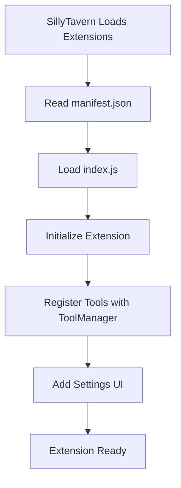
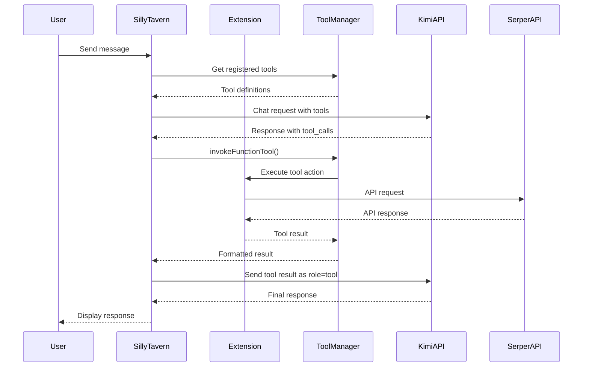
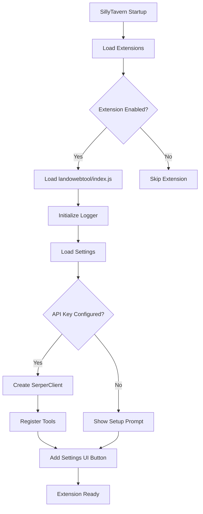
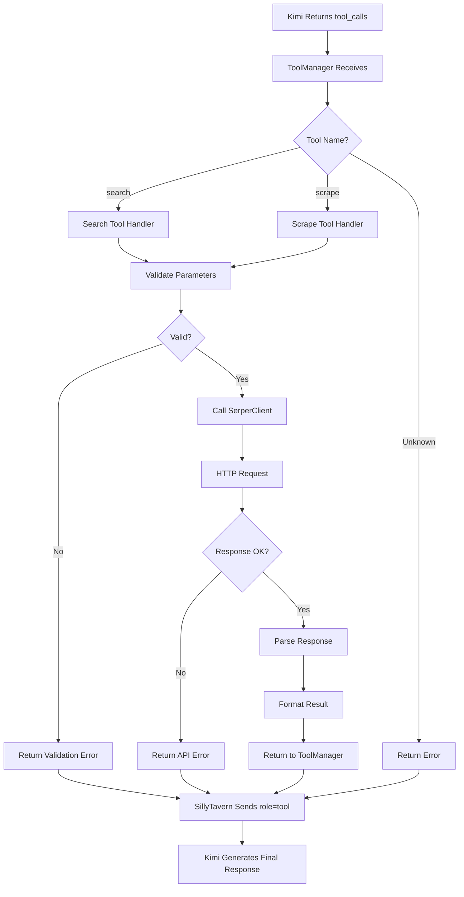

# Kimi 2.5 Tool Calling Extension - Architecture Design

## Overview

This extension enables Kimi 2.5 (Moonshot API) tool calling functionality for SillyTavern, providing web search and web scraping capabilities through the Serper API.

## Table of Contents

1. [Directory Structure](#directory-structure)
2. [File Organization](#file-organization)
3. [TypeScript Type Definitions](#typescript-type-definitions)
4. [Extension Registration](#extension-registration)
5. [Tool Call Flow](#tool-call-flow)
6. [Serper API Integration](#serper-api-integration)
7. [Settings UI Design](#settings-ui-design)
8. [Data Flow Diagram](#data-flow-diagram)

---

## Directory Structure

```
public/scripts/extensions/landowebtool/
├── manifest.json                 # Extension manifest for SillyTavern
├── index.js                     # Main extension entry point
├── types/
│   └── index.ts                 # TypeScript type definitions
├── tools/
│   ├── index.ts                  # Tool registry and registration
│   ├── search.ts                 # Web search tool implementation
│   └── scrape.ts                 # Web scraping tool implementation
├── api/
│   ├── serper.ts                 # Serper API client
│   └── types.ts                 # Serper API response types
├── ui/
│   ├── settings.ts                # Settings UI component
│   └── settings.html             # Settings template
├── utils/
│   ├── constants.ts               # Extension constants
│   └── logger.ts                 # Logging utilities
└── toolcalldocs/                # Documentation (existing)
    ├── kimi tool call doc.md
    ├── sillytavern tool call doc.md
    ├── serper implementation.md
    └── edits needed in prompt-converters.js.md
```

---

## File Organization

### Core Files

| File | Purpose | Key Exports |
|-------|---------|--------------|
| [`manifest.json`](#manifestjson) | Extension metadata and loading configuration | N/A |
| [`index.js`](#indexjs) | Main entry point, initializes extension | `init()` |
| [`types/index.ts`](#typesindexts) | TypeScript type definitions | All shared types |

### Tool Files

| File | Purpose | Key Exports |
|-------|---------|--------------|
| [`tools/index.ts`](#toolsindexts) | Tool registry and registration | `registerTools()`, `unregisterTools()` |
| [`tools/search.ts`](#toolssearchts) | Web search tool implementation | `searchTool` |
| [`tools/scrape.ts`](#toolsscrapets) | Web scraping tool implementation | `scrapeTool` |

### API Files

| File | Purpose | Key Exports |
|-------|---------|--------------|
| [`api/serper.ts`](#apiserperts) | Serper API client | `SerperClient` class |
| [`api/types.ts`](#apitypests) | Serper API response types | `SearchResponse`, `ScrapeResponse` |

### UI Files

| File | Purpose | Key Exports |
|-------|---------|--------------|
| [`ui/settings.ts`](#uisettingsts) | Settings UI component | `renderSettings()`, `saveSettings()` |
| [`ui/settings.html`](#uisettingshtml) | Settings HTML template | N/A |

### Utility Files

| File | Purpose | Key Exports |
|-------|---------|--------------|
| [`utils/constants.ts`](#utilsconstantsts) | Extension constants | `EXTENSION_NAME`, `TOOL_NAMES` |
| [`utils/logger.ts`](#utilsloggets) | Logging utilities | `Logger` class |

---

## TypeScript Type Definitions

### Core Types (`types/index.ts`)

```typescript
/**
 * Represents a tool definition for Kimi/Moonshot API
 * Follows OpenAI-compatible function calling format
 */
interface ToolDefinition {
    type: 'function';
    function: {
        name: string;
        description: string;
        parameters: JSONSchema;
    };
}

/**
 * JSON Schema for tool parameters
 */
interface JSONSchema {
    type: 'object';
    properties: Record<string, JSONSchemaProperty>;
    required: string[];
}

/**
 * Property definition in JSON Schema
 */
interface JSONSchemaProperty {
    type: string;
    description: string;
}

/**
 * Represents a tool call from Kimi API response
 */
interface ToolCall {
    id: string;
    type: 'function';
    function: {
        name: string;
        arguments: string; // JSON string
    };
}

/**
 * Represents a tool result message sent back to model
 */
interface ToolResultMessage {
    role: 'tool';
    tool_call_id: string;
    name: string;
    content: string; // JSON stringified result
}

/**
 * Extension settings stored in SillyTavern
 */
interface ExtensionSettings {
    serperApiKey: string;
    enabled: boolean;
    maxResults: number;
    timeout: number;
}

/**
 * Tool invocation result
 */
interface ToolInvocationResult {
    success: boolean;
    result?: any;
    error?: Error;
}
```

### Serper API Types (`api/types.ts`)

```typescript
/**
 * Serper search response structure
 */
interface SerperSearchResponse {
    answerBox?: {
        answer: string;
        snippet: string;
        title: string;
        link: string;
    };
    knowledgeGraph?: {
        description: string;
        title: string;
        type: string;
    };
    organic: Array<{
        title: string;
        link: string;
        snippet: string;
        position: number;
    }>;
    peopleAlsoAsk?: Array<{
        question: string;
        snippet: string;
        title: string;
        link: string;
    }>;
    relatedSearches?: Array<{
        query: string;
    }>;
    images?: Array<{
        title: string;
        link: string;
        imageUrl: string;
    }>;
}

/**
 * Serper scrape response structure
 * Actual API returns: {text, metadata: {title}, credits}
 */
interface SerperScrapeResponse {
    text: string;                    // The scraped content
    metadata: {
        title: string;              // Page title
    };
    credits: number;                // Credits used for the request
    // Note: URL and statusCode are not returned by Serper API
    // These are added during response formatting
}

/**
 * Search request parameters
 */
interface SearchRequest {
    q: string; // Query string
    num?: number; // Number of results (default: 10)
    page?: number; // Page number
}

/**
 * Scrape request parameters
 */
interface ScrapeRequest {
    url: string;
}
```

---

## Extension Registration

### manifest.json

```json
{
    "display_name": "Landowebtool",
    "loading_order": 20,
    "requires": [],
    "optional": [],
    "js": "index.js",
    "css": "style.css",
    "author": "Extension Author",
    "version": "1.0.0",
    "homePage": "https://github.com/your-repo",
    "settings": true
}
```

### Registration Flow



### Tool Registration (`tools/index.ts`)

The extension registers two tools with SillyTavern's `ToolManager`:

1. **search** - Web search using Serper API
2. **scrape** - Web page scraping using Serper API

Registration uses the `ToolManager.registerFunctionTool()` method with:
- `name`: Unique tool identifier
- `displayName`: User-friendly display name
- `description`: Tool functionality description
- `parameters`: JSON Schema for parameters
- `action`: Async function to execute the tool
- `formatMessage`: Function to format tool call toast message
- `shouldRegister`: Function to determine if tool should be registered

---

## Tool Call Flow

### Complete Tool Call Lifecycle



### Tool Call Execution Steps

1. **Model Returns Tool Call**
   - Kimi API responds with `finish_reason: "tool_calls"`
   - Response contains `tool_calls` array with tool name and arguments

2. **Tool Invocation**
   - SillyTavern's `ToolManager.invokeFunctionTool()` is called
   - Extension's tool action function receives parsed parameters

3. **API Execution**
   - Tool action makes HTTP request to Serper API
   - API key from extension settings is used for authentication
   - Response is parsed and formatted

4. **Result Return**
   - Tool result is returned as string or JSON-stringified object
   - SillyTavern constructs `role: "tool"` message
   - Message includes `tool_call_id`, `name`, and `content`

5. **Final Generation**
   - Tool result is sent back to Kimi API
   - Model generates final response based on tool results

---

## Serper API Integration

### API Client Class (`api/serper.ts`)

```typescript
class SerperClient {
    private apiKey: string;
    private baseUrl: string = 'https://google.serper.dev';
    private scrapeUrl: string = 'https://scrape.serper.dev';

    constructor(apiKey: string) {
        this.apiKey = apiKey;
    }

    /**
     * Performs web search using Serper API
     * @param query - Search query string
     * @param options - Optional search options
     * @returns Search results
     */
    async search(query: string, options?: SearchOptions): Promise<SerperSearchResponse> {
        // Implementation details in implementation phase
    }

    /**
     * Scrapes a web page using Serper API
     * @param url - URL to scrape
     * @returns Scraped page content
     */
    async scrape(url: string): Promise<SerperScrapeResponse> {
        // Implementation details in implementation phase
    }
}
```

### API Request Format

**Search Request:**
```http
POST https://google.serper.dev/search
Headers:
    X-API-KEY: <your-api-key>
    Content-Type: application/json
Body:
    {
        "q": "search query",
        "num": 10
    }
```

**Scrape Request:**
```http
POST https://scrape.serper.dev
Headers:
    X-API-KEY: <your-api-key>
    Content-Type: application/json
Body:
    {
        "url": "https://example.com"
    }
```

### Error Handling

- Network errors: Retry with exponential backoff (max 3 retries)
- API errors: Return error message as tool result
- Timeout errors: Use configurable timeout (default: 30 seconds)
- Invalid API key: Show user-friendly error in settings UI

---

## Settings UI Design

### Settings Component Structure

```typescript
interface SettingsState {
    apiKey: string;
    enabled: boolean;
    maxResults: number;
    timeout: number;
}
```

### Settings UI Layout

```
┌─────────────────────────────────────────────────────┐
│  Landowebtool Settings                        │
├─────────────────────────────────────────────────────┤
│                                             │
│  [x] Enable Web Tools                         │
│                                             │
│  Serper API Key:                              │
│  [_____________________________] [Test]          │
│                                             │
│  Max Results: [5] (1-20)                   │
│                                             │
│  Request Timeout: [30] seconds (5-120)        │
│                                             │
│  ──────────────────────────────────────────────  │
│                                             │
│  Status: API Key Valid ✓                      │
│                                             │
│  [Save] [Reset to Defaults]                   │
│                                             │
└─────────────────────────────────────────────────────┘
```

### Settings Storage

Settings are stored in SillyTavern's `extension_settings` object:

```javascript
extension_settings.kimiWebTools = {
    serperApiKey: 'sk-...',
    enabled: true,
    maxResults: 10,
    timeout: 30
};
```

### Settings Events

- **onApiKeyChange**: Validate API key immediately
- **onSave**: Persist settings to SillyTavern storage
- **onReset**: Restore default values

---

## Data Flow Diagram

### Extension Initialization Flow



### Tool Execution Flow



---

## Tool Definitions

### Search Tool

```typescript
const searchTool = {
    name: 'search',
    displayName: 'Web Search',
    description: `Search for content on the internet using a search engine.

    When your knowledge cannot answer the user's question, or when the user requests an online search, call this tool. Extract the content the user wants to search from the conversation as the value of the query parameter.
    The search results include the website title, website address (URL), and website description.`,
    parameters: {
        type: 'object',
        required: ['query'],
        properties: {
            query: {
                type: 'string',
                description: 'The content the user wants to search for, extracted from the user question or chat context.'
            }
        }
    },
    action: async (params) => {
        // Execute search via Serper API
    },
    formatMessage: async (params) => {
        return `Searching for: ${params.query}`;
    },
    shouldRegister: async () => {
        // Check if API key is configured
        return !!extension_settings.kimiWebTools?.serperApiKey;
    }
};
```

### Scrape Tool

```typescript
const scrapeTool = {
    name: 'scrape',
    displayName: 'Web Scraping',
    description: `Get the content of a webpage based on the website address (URL).

    Use this tool to retrieve the full text content of a web page. The URL should be obtained from search results.`,
    parameters: {
        type: 'object',
        required: ['url'],
        properties: {
            url: {
                type: 'string',
                description: 'The website address (URL) of the content to be obtained, which can usually be obtained from the search results.'
            }
        }
    },
    action: async (params) => {
        // Execute scrape via Serper API
    },
    formatMessage: async (params) => {
        return `Scraping: ${params.url}`;
    },
    shouldRegister: async () => {
        return !!extension_settings.kimiWebTools?.serperApiKey;
    }
};
```

---

## Integration Points

### SillyTavern Extension System

- **Extension Loading**: Via [`extensions.js`](public/scripts/extensions.js:354-379) manifest loading
- **Tool Registration**: Via [`ToolManager.registerFunctionTool()`](public/scripts/tool-calling.js:267-289)
- **Settings Storage**: Via `extension_settings` object
- **UI Integration**: Via extension menu button

### Tool Calling System

- **Tool Detection**: [`ToolManager.hasToolCalls()`](public/scripts/tool-calling.js:758-761)
- **Tool Invocation**: [`ToolManager.invokeFunctionTool()`](public/scripts/tool-calling.js:323-343)
- **Result Formatting**: [`ToolManager.formatToolCallMessage()`](public/scripts/tool-calling.js:365-378)
- **Tool Result Saving**: [`ToolManager.saveFunctionToolInvocations()`](public/scripts/tool-calling.js:865-887)

### Event System

The extension will listen to:
- `event_types.EXTENSION_SETTINGS_LOADED` - Initialize after settings load
- `event_types.TOOL_CALLS_PERFORMED` - Log tool executions
- `event_types.CHAT_COMPLETION_SOURCE_CHANGED` - Re-register tools on API change

---

## Security Considerations

1. **API Key Storage**
   - Stored in SillyTavern's settings (server-side)
   - Never exposed to client-side JavaScript
   - Validated before use

2. **Input Validation**
   - All tool parameters validated before API calls
   - URL validation for scrape tool
   - Query sanitization for search tool

3. **Rate Limiting**
   - Respect Serper API rate limits
   - Implement request queuing if needed
   - Cache results to reduce API calls

4. **Error Handling**
   - Never expose raw API errors to users
   - Sanitize error messages before display
   - Log detailed errors for debugging

---

## Performance Considerations

1. **Lazy Loading**
   - Tools only registered when API key is configured
   - Settings UI loaded on-demand

2. **Caching**
   - Optional search result caching (configurable TTL)
   - Avoid duplicate API calls for same query

3. **Async Operations**
   - All API calls are non-blocking
   - Proper error handling with try/catch
   - Timeout handling for long requests

4. **Bundle Size**
   - Minimize dependencies
   - Use tree-shaking for TypeScript
   - Lazy load optional features

---

## Testing Strategy

1. **Unit Tests**
   - Tool parameter validation
   - API client methods
   - Error handling
   - Type safety

2. **Integration Tests**
   - Tool registration with ToolManager
   - Settings persistence
   - Tool call execution flow

3. **End-to-End Tests**
   - Complete search flow
   - Complete scrape flow
   - Multi-step tool calling (search → scrape)
   - Error recovery

---

## Future Enhancements

1. **Additional Tools**
   - Image search
   - News search
   - Local search integration

2. **Advanced Features**
   - Custom search engines
   - Result filtering
   - Export functionality

3. **UI Improvements**
   - Search history
   - Result preview
   - Keyboard shortcuts

---

## Notes

- This extension does NOT modify core SillyTavern files
- All functionality is contained within the extension directory
- The extension follows SillyTavern's extension conventions
- TypeScript is used for type safety, compiled to JavaScript for runtime
- Well-commented code for future maintainability
